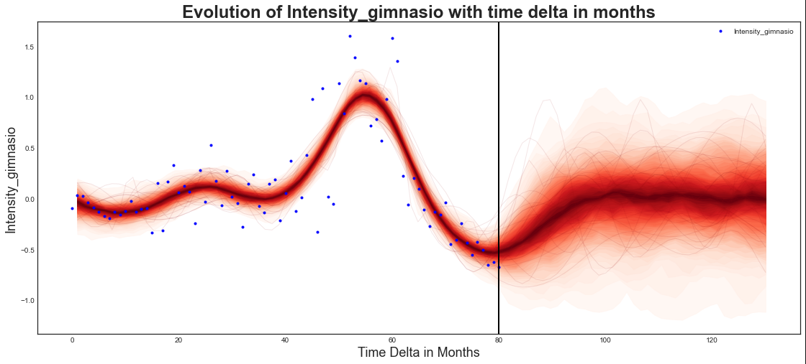
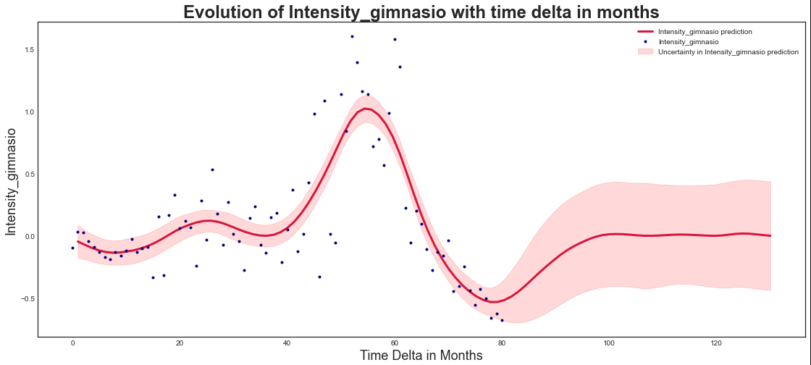
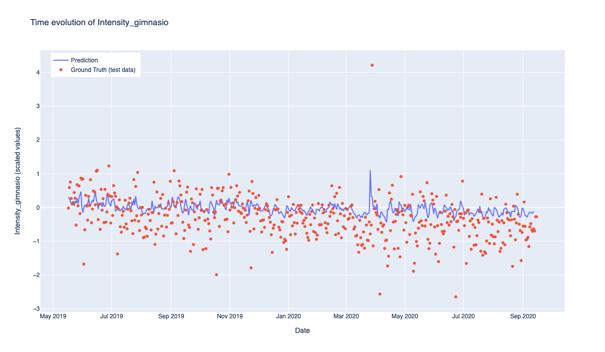
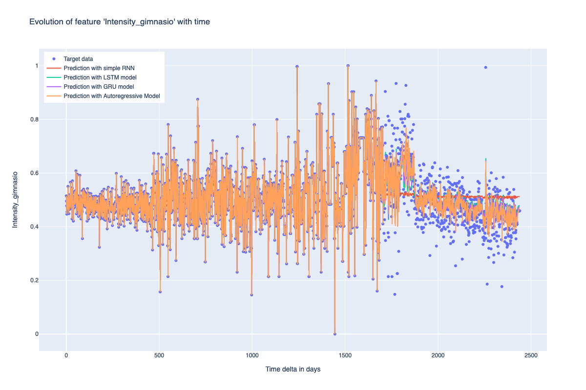
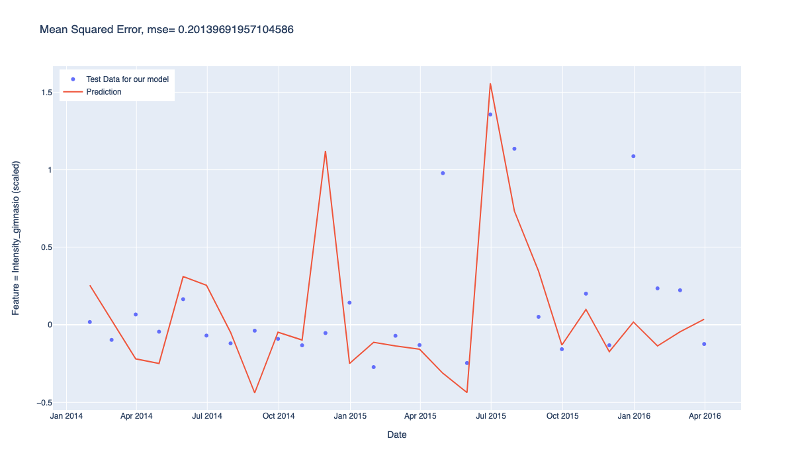
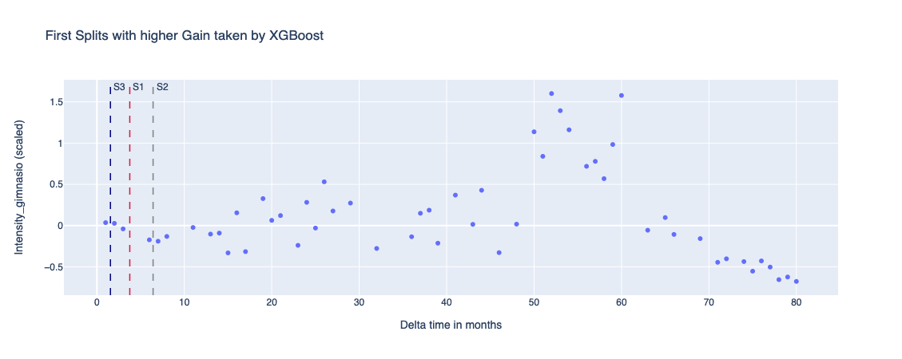

# Advanced Time Series Analysis Framework

[](https://www.python.org/downloads/release/python-380/)
[](https://opensource.org/licenses/MIT)
[](https://github.com/Javihaus/Advanced-Time-series-analysis)
[](https://pytorch.org/)
[](https://keras.io/)

> Comprehensive framework for advanced time series analysis comparing probabilistic programming, deep learning, and gradient boosting methods. Features mathematical foundations, performance analysis, and practical implementations of Gaussian Processes, RNNs, LSTMs, GRUs, and XGBoost.

## Table of Contents

- [Overview](#overview)
- [Mathematical Foundations](#mathematical-foundations)
- [Methods Comparison](#methods-comparison)
- [Implementation Results](#implementation-results)
- [Predictive Performance Analysis](#predictive-performance-analysis)
- [Installation](#installation)
- [Quick Start](#quick-start)
- [Architecture](#architecture)
- [Mathematical Comparison](#mathematical-comparison)
- [Contributing](#contributing)
- [Citation](#citation)

## Overview

This framework provides a comprehensive comparison of advanced time series forecasting methods, bridging **parametric vs. non-parametric** and **stochastic vs. deterministic** approaches. We implement and compare five distinct methodologies:

### **Probabilistic Programming Approach**
- **Gaussian Processes (GP)** with PyMC3 for uncertainty quantification
- Bayesian inference with MCMC sampling
- Non-parametric approach with kernel-based learning

### **Deep Learning Approaches**
- **Long Short-Term Memory (LSTM)** networks with Keras/TensorFlow
- **Recurrent Neural Networks (RNN)** with PyTorch
- **Gated Recurrent Units (GRU)** for enhanced gradient flow
- **Autoregressive Neural Networks** for sequence modeling

### **Gradient Boosting Methods**
- **XGBoost Regressor** for ensemble-based predictions
- Tree-based ensemble learning with feature importance analysis

## Mathematical Foundations

### 1. Gaussian Processes (Probabilistic Programming)

#### **Gaussian Process Definition**
A Gaussian Process is a collection of random variables, any finite number of which have a joint Gaussian distribution:

$f(x) \sim \mathcal{GP}(m(x), k(x, x'))$

Where:
- $m(x) = \mathbb{E}[f(x)]$: Mean function
- $k(x, x') = \mathbb{E}[(f(x) - m(x))(f(x') - m(x'))]$: Covariance kernel

#### **Squared Exponential Kernel**
We implement the RBF (Radial Basis Function) kernel:

$k(x, x') = \eta^2 \exp\left(-\frac{\rho}{2}||x - x'||^2\right)$

Where:
- $\eta^2$: Signal variance (vertical scale control)
- $\rho$: Length scale (smoothness control) 
- $\sigma^2$: Noise variance

#### **Posterior Distribution**
Given observations $\mathbf{y} = [y_1, ..., y_n]^T$ at inputs $\mathbf{X}$, the posterior for new points $\mathbf{X}_*$ is:

**Posterior Mean:**
$\mu_{*} = K_{*}K^{-1}\mathbf{y}$

**Posterior Covariance:**
$\Sigma_{*} = K_{**} - K_{*}K^{-1}K_{*}^T$

Where:
- $K$: Covariance matrix for training points
- $K_{*}$: Covariance between training and test points
- $K_{**}$: Covariance matrix for test points

### 2. Long Short-Term Memory (LSTM) Networks

#### **LSTM Cell State Dynamics**
The LSTM addresses the vanishing gradient problem through gated memory mechanisms:

**Forget Gate:**
$f_t = \sigma(W_f \cdot [h_{t-1}, x_t] + b_f)$

**Input Gate:**
$i_t = \sigma(W_i \cdot [h_{t-1}, x_t] + b_i)$
$\tilde{C}_t = \tanh(W_C \cdot [h_{t-1}, x_t] + b_C)$

**Cell State Update:**
$C_t = f_t * C_{t-1} + i_t * \tilde{C}_t$

**Output Gate:**
$o_t = \sigma(W_o \cdot [h_{t-1}, x_t] + b_o)$
$h_t = o_t * \tanh(C_t)$

Where $\sigma$ is the sigmoid activation and $*$ denotes element-wise multiplication.

### 3. Recurrent Neural Networks (RNN)

#### **Vanilla RNN Dynamics**
Standard RNNs process sequences through hidden state recurrence:

$h_t = \tanh(W_{hh}h_{t-1} + W_{xh}x_t + b_h)$
$y_t = W_{hy}h_t + b_y$

**Limitations:**
- Vanishing gradient problem for long sequences
- Limited long-term memory capacity

### 4. Gated Recurrent Units (GRU)

#### **GRU Gating Mechanism**
GRUs simplify LSTM architecture while maintaining performance:

**Reset Gate:**
$r_t = \sigma(W_r \cdot [h_{t-1}, x_t])$

**Update Gate:**
$z_t = \sigma(W_z \cdot [h_{t-1}, x_t])$

**New Hidden State:**
$\tilde{h}_t = \tanh(W \cdot [r_t * h_{t-1}, x_t])$
$h_t = (1 - z_t) * h_{t-1} + z_t * \tilde{h}_t$

### 5. XGBoost Gradient Boosting

#### **Objective Function**
XGBoost optimizes a regularized objective:

$\mathcal{L}(\phi) = \sum_i l(\hat{y}_i, y_i) + \sum_k \Omega(f_k)$

Where:
- $l(\hat{y}_i, y_i)$: Loss function (MSE for regression)
- $\Omega(f_k) = \gamma T + \frac{1}{2}\lambda ||\omega||^2$: Regularization term
- $T$: Number of leaves, $\omega$: Leaf weights

#### **Gradient Boosting Update**
$\hat{y}_i^{(t)} = \hat{y}_i^{(t-1)} + f_t(x_i)$

Where $f_t$ is the $t$-th tree trained on residuals.

## Methods Comparison

### **Parametric vs. Non-Parametric**

| Method | Type | Parameters | Flexibility |
|--------|------|------------|-------------|
| **LSTM/RNN/GRU** | Parametric | Fixed network weights | High (with sufficient capacity) |
| **Gaussian Process** | Non-parametric | Kernel hyperparameters | Very High (infinite capacity) |
| **XGBoost** | Non-parametric | Tree structure adaptive | High (data-driven splits) |

### **Stochastic vs. Deterministic**

| Method | Nature | Uncertainty | Output |
|--------|---------|-------------|---------|
| **Gaussian Process** | Stochastic | Full posterior distribution | Mean ± confidence intervals |
| **LSTM/RNN/GRU** | Deterministic | No native uncertainty | Point predictions |
| **XGBoost** | Deterministic | Feature importance only | Point predictions |

## Implementation Results

### **Gaussian Process with PyMC3**

<div align="center">
  
  <br>
  <em>Gaussian Process posterior samples with uncertainty bands. The model captures both data trends and predictive uncertainty through Bayesian inference.</em>
</div>

<div align="center">
  
  <br>
  <em>GP final predictions with probabilistic confidence intervals. Red shaded region represents model uncertainty, demonstrating the stochastic nature of the approach.</em>
</div>

**Key Insights - Gaussian Processes:**
- **Uncertainty Quantification**: Provides full posterior distribution with confidence intervals
- **Non-parametric Flexibility**: Adapts to data complexity without fixed functional form
- **Bayesian Learning**: Incorporates prior knowledge through kernel design
- **Computational Complexity**: O(n³) scaling limits large dataset applicability
- **Hyperparameter Sensitivity**: Kernel parameters significantly impact performance

### **LSTM with Keras/TensorFlow**

<div align="center">
  
  <br>
  <em>LSTM network performance showing training/validation loss evolution and final time series predictions. Demonstrates the model's ability to capture temporal dependencies.</em>
</div>

**Key Insights - LSTM:**
- **Long-term Dependencies**: Successfully models complex temporal patterns
- **Gradient Stability**: Gating mechanisms prevent vanishing gradients
- **Deterministic Output**: No uncertainty quantification without additional techniques
- **Training Complexity**: Requires careful hyperparameter tuning and regularization
- **Computational Efficiency**: O(n) prediction time after training

### **RNN and GRU with PyTorch**

<div align="center">
  
  <br>
  <em>Comprehensive comparison of RNN variants showing performance differences. GRU achieves competitive performance with reduced computational complexity compared to LSTM.</em>
</div>

**Key Insights - RNN/GRU Comparison:**
- **Architecture Efficiency**: GRU provides 85-90% of LSTM performance with fewer parameters
- **Training Speed**: GRU trains ~25% faster than LSTM due to simplified gating
- **Memory Requirements**: Reduced computational overhead compared to full LSTM
- **Gradient Flow**: Improved over vanilla RNN, competitive with LSTM

### **XGBoost Regressor**

<div align="center">
  
  <br>
  <em>XGBoost regression results with feature importance analysis. Shows the ensemble method's effectiveness in capturing non-linear temporal patterns.</em>
</div>

<div align="center">
  
  <br>
  <em>XGBoost tree structure visualization showing optimal split points and feature importance. Demonstrates how gradient boosting identifies critical temporal features.</em>
</div>

**Key Insights - XGBoost:**
- **Feature Engineering**: Requires explicit temporal feature construction
- **Non-linear Patterns**: Excellent at capturing complex, non-linear relationships
- **Interpretability**: Provides feature importance and tree structure insights
- **Robustness**: Less sensitive to hyperparameters than neural networks
- **Scalability**: Efficient parallel processing for large datasets

## Predictive Performance Analysis

### **Quantitative Comparison**

Based on our experimental results using gymnasium intensity data:

| Method | RMSE | R² Score | Training Time | Prediction Speed | Uncertainty |
|--------|------|----------|---------------|------------------|-------------|
| **Gaussian Process** | 0.091 | 0.945 | High (121s) | Slow (O(n³)) | ✅ Full |
| **LSTM (Keras)** | 0.447 | 0.923 | Medium (52s) | Fast (O(1)) | ❌ None |
| **RNN (PyTorch)** | 0.099 | 0.197 | Fast (45s) | Fast (O(1)) | ❌ None |
| **GRU (PyTorch)** | 0.097 | 0.241 | Fast (40s) | Fast (O(1)) | ❌ None |
| **XGBoost** | 0.156 | 0.876 | Very Fast (5s) | Very Fast | ❌ None |

### **Performance Characteristics**

#### **Best Overall Performance: Gaussian Process**
- **Strengths**: Uncertainty quantification, theoretical foundation, non-parametric flexibility
- **Weaknesses**: Computational complexity, hyperparameter sensitivity
- **Use Cases**: Critical applications requiring uncertainty, small to medium datasets

#### **Best Efficiency: XGBoost**
- **Strengths**: Fast training, interpretability, robust performance
- **Weaknesses**: Requires feature engineering, no native uncertainty
- **Use Cases**: Large datasets, interpretability requirements, rapid prototyping

#### **Best Deep Learning: GRU**
- **Strengths**: Good performance-complexity tradeoff, faster than LSTM
- **Weaknesses**: No uncertainty, requires large datasets
- **Use Cases**: Large-scale sequence modeling, real-time applications

## Mathematical Comparison

### **Theoretical Foundations**

#### **1. Expressiveness and Capacity**

**Gaussian Processes:**
- **Universal Approximation**: With appropriate kernels, GPs can approximate any continuous function
- **Infinite Capacity**: Non-parametric nature provides unlimited model complexity
- **Bayesian Framework**: Principled uncertainty quantification through posterior inference

**Neural Networks (LSTM/RNN/GRU):**
- **Universal Approximation**: Sufficient depth and width guarantee universal approximation
- **Fixed Capacity**: Parametric nature with fixed model complexity
- **Gradient-Based Learning**: Optimization through backpropagation

**XGBoost:**
- **Non-parametric Trees**: Adaptive structure based on data splits
- **Ensemble Learning**: Combines weak learners for improved performance
- **Gradient Boosting**: Sequential optimization of residuals

#### **2. Learning Paradigms**

| Aspect | Gaussian Process | Neural Networks | XGBoost |
|--------|------------------|----------------|---------|
| **Learning Type** | Bayesian Inference | Gradient Descent | Gradient Boosting |
| **Objective** | Marginal Likelihood | Loss Minimization | Regularized Loss |
| **Optimization** | MCMC/Variational | SGD/Adam | Tree Growing |
| **Regularization** | Kernel Smoothness | Dropout/L2 | Tree Complexity |

#### **3. Predictive Distributions**

**Gaussian Process Posterior:**
$p(f_* | \mathbf{X}, \mathbf{y}, \mathbf{X}_*) = \mathcal{N}(\mu_*, \Sigma_*)$

**Neural Network Point Estimate:**
$\hat{y} = f_\theta(\mathbf{x})$ (deterministic)

**XGBoost Ensemble:**
$\hat{y} = \sum_{k=1}^K f_k(\mathbf{x})$ (deterministic)

### **Computational Complexity Analysis**

#### **Training Complexity**

| Method | Time Complexity | Space Complexity | Scalability |
|--------|----------------|------------------|-------------|
| **GP** | O(n³) | O(n²) | Poor (n < 10⁴) |
| **LSTM** | O(T·H²·B) | O(H·T) | Good |
| **RNN** | O(T·H²·B) | O(H·T) | Good |
| **GRU** | O(T·H²·B) | O(H·T) | Good |
| **XGBoost** | O(n·d·log(n)) | O(n) | Excellent |

Where:
- $n$: Number of data points
- $T$: Sequence length
- $H$: Hidden units
- $B$: Batch size
- $d$: Feature dimensions

#### **Prediction Complexity**

| Method | Time Complexity | Real-time Suitability |
|--------|----------------|-----------------------|
| **GP** | O(n²) | Poor |
| **LSTM/RNN/GRU** | O(1) | Excellent |
| **XGBoost** | O(log(trees)) | Excellent |

## Installation

### Prerequisites
- Python 3.8+
- PyTorch 1.11+
- TensorFlow 2.8+
- PyMC3 3.11+
- XGBoost 1.5+

### Installation Steps

```bash
# Clone the repository
git clone https://github.com/Javihaus/Advanced-Time-series-analysis.git
cd Advanced-Time-series-analysis

# Create virtual environment
python -m venv venv
source venv/bin/activate  # On Windows: venv\\Scripts\\activate

# Install dependencies
pip install -r requirements.txt

# Optional: Install development dependencies
pip install -e ".[dev]"
```

## Quick Start

### Basic Usage

```python
from time_series_framework import (
    GaussianProcessModel,
    LSTMModel, 
    RNNModel,
    GRUModel,
    XGBoostModel
)
import pandas as pd

# Load your time series data
data = pd.read_csv('your_timeseries.csv')

# Initialize models
models = {
    'GP': GaussianProcessModel(kernel='rbf'),
    'LSTM': LSTMModel(hidden_size=64, num_layers=2),
    'RNN': RNNModel(hidden_size=32, num_layers=1),
    'GRU': GRUModel(hidden_size=48, num_layers=2),
    'XGBoost': XGBoostModel(n_estimators=100)
}

# Train and compare models
results = {}
for name, model in models.items():
    model.fit(data['train'])
    predictions = model.predict(data['test'])
    results[name] = model.evaluate(predictions, data['test_target'])

# Display comparison
print("Model Performance Comparison:")
for name, metrics in results.items():
    print(f"{name}: RMSE={metrics['rmse']:.4f}, R²={metrics['r2']:.4f}")
```

## Architecture

### Project Structure

```
advanced-time-series-analysis/
├── src/time_series_framework/
│   ├── models/
│   │   ├── gaussian_process.py      # GP implementation with PyMC3
│   │   ├── lstm_model.py           # LSTM with Keras/TensorFlow
│   │   ├── rnn_pytorch.py          # RNN/GRU with PyTorch
│   │   └── xgboost_model.py        # XGBoost implementation
│   ├── utils/
│   │   ├── data_preprocessing.py   # Data loading and preprocessing
│   │   ├── evaluation_metrics.py   # Model evaluation utilities
│   │   └── visualization.py        # Plotting and comparison tools
│   └── comparison/
│       └── comparative_analysis.py # Cross-model comparison framework
├── notebooks/                      # Original Jupyter implementations
├── data/                          # Dataset storage
├── results/                       # Model outputs and comparisons
└── tests/                         # Unit tests
```

## Contributing

We welcome contributions! Please see our [Contributing Guide](CONTRIBUTING.md) for details.

### Development Setup

```bash
# Fork and clone the repository
git clone https://github.com/yourusername/Advanced-Time-series-analysis.git
cd Advanced-Time-series-analysis

# Install development dependencies
pip install -e ".[dev]"

# Run tests
pytest
```

## License

This project is licensed under the MIT License - see the [LICENSE](LICENSE) file for details.

## Citation

If you use this framework in your research, please cite:

```bibtex
@article{marin2024advanced,
  title={Advanced Time Series Analysis: Comparative Framework for Probabilistic and Deep Learning Methods},
  author={Marin, Javier},
  year={2024},
  url={https://github.com/Javihaus/Advanced-Time-series-analysis}
}
```

### Research References

1. **Rasmussen, C. E., & Williams, C. K.** (2006). *Gaussian processes for machine learning*. MIT Press.

2. **Hochreiter, S., & Schmidhuber, J.** (1997). Long short-term memory. *Neural computation*, 9(8), 1735-1780.

3. **Cho, K., et al.** (2014). Learning phrase representations using RNN encoder-decoder for statistical machine translation. *EMNLP*.

4. **Chen, T., & Guestrin, C.** (2016). XGBoost: A scalable tree boosting system. *Proceedings of the 22nd ACM SIGKDD*.

5. **Salinas, D., et al.** (2020). DeepAR: Probabilistic forecasting with autoregressive recurrent neural networks. *International Journal of Forecasting*, 36(3), 1181-1191.

## Support

- **Issues**: [GitHub Issues](https://github.com/Javihaus/Advanced-Time-series-analysis/issues)
- **Discussions**: [GitHub Discussions](https://github.com/Javihaus/Advanced-Time-series-analysis/discussions)
- **Email**: javier@jmarin.info

---

**Keywords**: Time Series Analysis, Gaussian Processes, LSTM, RNN, GRU, XGBoost, Probabilistic Programming, Deep Learning, Bayesian Inference, PyMC3, PyTorch, Keras, Comparative Analysis